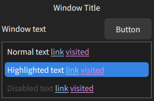
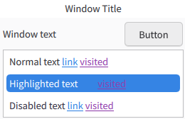

# Libadwaita KDE 
A attempt at porting the Libadwaita look to KDE/Qt.
This is a work in progress, install scripts, and further things will be added in the future.

## Finished Implementations
- KColorSchemes
- Aurorae (dark mode only)

## To Do
- Aurorae Light mode
- Kvantum theme
- Plasma Style
- GDM-like SDDM theme

## KColorSchemes

### Main color support
- Dark
- Light
### Accent color support
- Default (Blue)
- Teal
- Green
- Yellow
- Orange
- Red
- Pink
- Purple
- Grey
### Specifics
Made to Look similar to Libadwaita in colors, while trying to fit in with the standard Libadwaita apps, this can lead to inconsistancies in some cases, but in other cases doing it tho more "exact" way will also lead to inconsistancies, i decided to go with trying to fit most Libadwaita apps, as the inconsistancies coming with it are less annoying.

## Aurorae

<!-- ADD ONCE LIGHT MODE ADDED  -->

### Main color support
- Dark
### Specifics
The Aurorae is made to look as similar as possible to the Libadwaita headerbar, but making it a little more compact to better fit in with the Plasma Desktop, and to save space.
