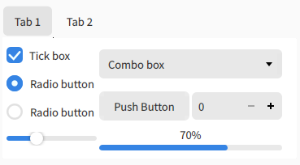

# Libadwaita KDE 
A attempt at porting the Libadwaita look to KDE/Qt.
This is a work in progress, install scripts, and further things will be added in the future.
A SDDM theme isnt planed anymore, just use GDM.

---

## To Do
- [x] KColorSchemes
- [x] Aurorae
- [x] Kvantum theme
- [x] Plasma Style
- [x] Fcitx5 Theme

---

### General Notes
- The themes are made with the intent of looking like libadwaita, while also containing a little bit more color.
- The themes are made with the intent that you adjust them to your prefference 

## KColorSchemes

Based on [Libadw Compilation](https://www.pling.com/p/2175326/)

### Main colour support
- [x] Dark
- [x] Light
### Accent colour support
- [x] Default (Blue)
- [x] Teal
- [x] Green
- [x] Yellow
- [x] Orange
- [x] Red
- [x] Pink
- [x] Purple
- [x] Grey

---

## Aurorae

 

Based on [Colloid aurorae theme](https://www.pling.com/p/1738680/) and [Nova](https://www.pling.com/p/1662814/)

### Main colour support
- [x] Light
- [x] Dark
### Button Support
- [x] Close
- [x] Show on all desktops
### Recomended Settings
- Button Size: Tiny

### Rounded Corners
I recomend using [KDE-Rounded-Corners](https://github.com/matinlotfali/KDE-Rounded-Corners) to get all window corners to be round, this will make the theme look more accurate to libadwaita. **Note:** you cant use the custom aurorae with this, its a tradeoff between button accuracy and rounding accuracy.

---

## Kvantum

 
 

Based on [Orchis Kvantum](https://www.pling.com/p/1458909/) 

### Main colour support
- [x] Light
- [x] Dark
### Accent colour support
- [x] Default (Blue)
- [ ] Teal
- [ ] Green
- [ ] Yellow
- [ ] Orange
- [ ] Red
- [x] Pink
- [ ] Purple
- [ ] Grey

**Notes:** Needs more accent colors added.

---

## Plasma Style
Based on [Nova](https://www.pling.com/p/1659120/) and [Colloid](https://www.pling.com/p/1738718/)
I didnt do much on this except swap out a few files.

### Main colour support
- [x] Automatic

### Accent colour support
- [x] Automatic

**Notes:** Panel needs to be made black to fit with the GNOME panel.

## Fcitx5 Theme
Not really based on anything.
 
### Main colorour support
- [ ] Light
- [x] Dark
 
### Accent colour support
- [ ] Default (Blue)
- [ ] Teal
- [ ] Green
- [x] Yellow
- [ ] Orange
- [ ] Red
- [ ] Pink
- [ ] Purple
- [ ] Grey

**Notes:** Coloration might not be perfect, cant really be bothered though, considering how few will even use this.
